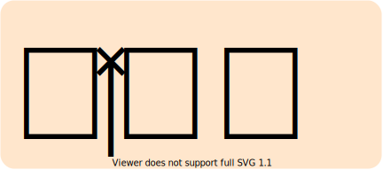
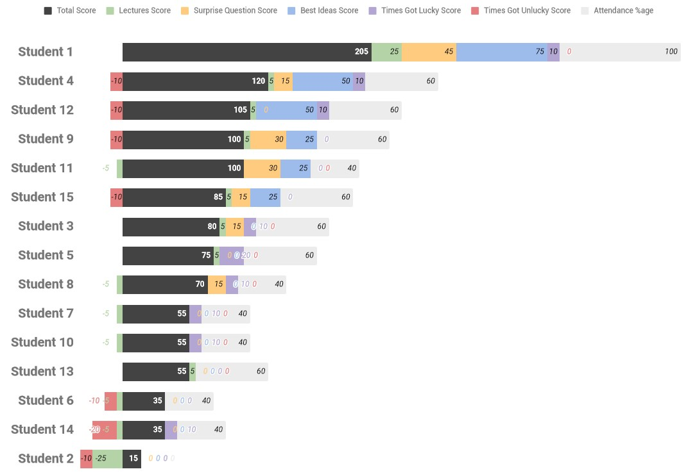

<!-- PROJECT LOGO -->
 

  
  <h2 align="center">classroom-gamification</h2>
  

    Tool to gamify your classroom with an online leaderboard    
  

---
 

## Table of Contents

- [About](#about)
- [Features](#features)
- [How to use?](#how-to-use)
- [Contributing](#contributing)
- [License](#license)
- [Contact](#contact)

## About

This is a simple tool to gamify your classroom with an online leaderboard. It is a simple HTML file showing the preview of the bar chart in the google spreadsheet. The leaderboard shows the overall score (and sub-scores) obtained by each student in descending order. The highest scorer wins!!

Everything happens in the google spreadsheet, which consists of 5 different sheets. Teacher have to enter the record of each defined-activity/rule in the `Lecture Record` sheet after each lecture and the final chart is updated automatically.

The leader board has a set of pre-defined simple rules. The score for each rule can be changed in the `Summary` sheet.

1. Base score of 0 points is given to all at start. (Sorry no free lunch!!)
2. +5 points for every lecture attended.
3. +15 points for each surprise question answered. (We will randomly call you)
4. +25 points each for the best idea given in the class. (You can voluntarily give your idea)
5. +10 points each time for winning lottery. (We will randomly call you)
6. -5 points for each lecture missed.
7. -10 points for each time you were missed when your name was called for surprise question.  

## Features

- All tools are free (google sheet for records and computation, GitHub for hosting)
- As a side benefit, teacher can have a record of attendance and other activities of the students 

## How to use?

1. Fork this repository
2. Copy the main google spreadsheet, pre-filled with dummy data is a google sheet document ([link](https://docs.google.com/spreadsheets/d/1mWH_DFhzaR49LRrwp9C1v50xThY7S6EReM69Ug8Dpks/edit?usp=sharing)) to your google drive.
3. Enter the details of the students in the `Student Database` sheet.
4. Optionally change the scores for the rules in the `Summary` sheet.
5. Starts maintaining record in the `Lecture Record` sheet.  
6. Go to `Leaderboard Chart` sheet, click on the three dots in the upper-right corner of the chart, and select publish chart. Copy the link to the `iframe` section of the `index.html` file.
6. Publish by navigating to `Settings` > `Pages` in your repository.

## Contributing

Any contributions you make are greatly appreciated. You can contribute to this project in the following ways :

- Add new functionality
- Review code
- Raise issues about bugs/features/doubts
- Star on GitHub
- Share with others

Please note that this project is released with a [Contributor Code of Conduct](https://github.com/kulbhushanchand/classroom-gamification/blob/master/CODE_OF_CONDUCT.md). By contributing to this project you agree to abide by its terms.

## License

This project is distributed under the `GPLv3` License. See [LICENSE](https://github.com/kulbhushanchand/classroom-gamification/blob/master/LICENSE) for more information.

## Contact

[Kulbhushan Chand](https://kulbhushanchand.github.io/about/)